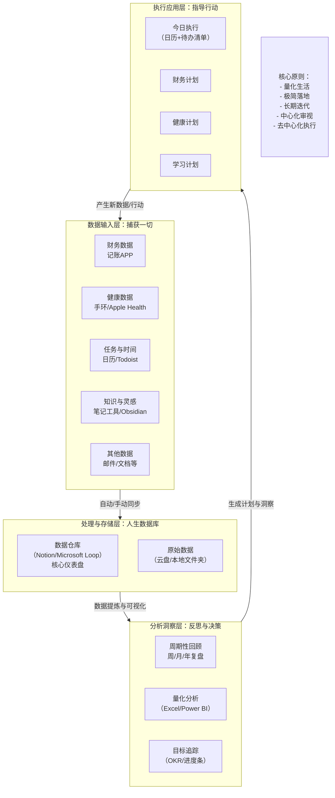

👌 明白了，你希望的是：

* **框架更极简** → 一眼就能记住
* **实施更轻量** → 不会因为记录和复盘太复杂而放弃
* **模块可扩可并** → 保持灵活

那我帮你把「人生OS」进一步压缩为一个 **3-4-1 极简模型**：

---

# 🧭 人生OS 极简架构 v1.1

## **一、3 个原则**

1. **少即是多**：指标 ≤ 7 个，工具 ≤ 5 个。
2. **周期复盘**：双周 1 次，轻松维持闭环。
3. **迭代演进**：模块可加减，流程不变。

---

## **二、4 大模块**

（可扩展，但始终保持 4 个视角，避免碎片化）

| 模块         | 关注点     | 最小指标 (双周看一次)     | 例子        |
| ---------- | ------- | ---------------- | --------- |
| 🎯 目标 & 行动 | 目标拆解到任务 | 本双周完成率 ≥80%      | 任务清单      |
| 💰 财务 & 资产 | 收支与储蓄   | 结余率 ≥30%         | 记账 App 导出 |
| 🏃 健康 & 能量 | 睡眠+运动   | 睡眠 ≥7h、运动 ≥3次/双周 | 健康 App    |
| 📚 成长 & 关系 | 知识+社交   | 输出 ≥1 篇，联系 ≥2 人  | 笔记/联系人表   |

👉 如果将来需要细化，比如「知识」单独拆成模块，就在这一层扩展，不改整体框架。

---

## **三、1 个中枢**

用 **Hugo Hub** 作为唯一总览入口：

```markdown
# 人生OS Dashboard

## 🎯 行动
- 本双周 3 大任务
- 完成率：80%

## 💰 财务
- 本双周支出：¥xxxx
- 结余率：35%

## 🏃 健康
- 平均睡眠：7.1h
- 运动次数：3/4

## 📚 成长 & 关系
- 阅读：《原则》进度 70%
- 输出：1 篇周记
- 联系：2/2
```

---

## **四、复盘机制**

* **双周一次**（30 分钟即可）
  模板三问：

  1. ✅ 哪 3 件事做得最好？
  2. ❌ 哪 1 件事需要改进？
  3. 🔄 下个双周尝试什么新实验？

* **年度一次大审计**
  删除冗余模块/指标，更新长期目标。

---

## **五、落地 3 步走**

1. **Day0**：建一个 Hugo Hub 页面，写上 4 大模块的框架。
2. **Day1**：导入财务和健康的最近一次数据，填进去。
3. **Day14**：做第一次双周复盘，回答 3 个问题。

---

## 🌱 总结

* 记住口诀：**「3-4-1」**

  * 3 原则（少即是多、双周复盘、迭代演进）
  * 4 模块（行动、财务、健康、成长）
  * 1 中枢（Hugo Hub 总览页）
* 轻量闭环，避免繁琐；模块可增可并，系统自然长大。

---

要不要我直接帮你写一个 **双周复盘 Hugo 模板**（带表格+3个问题），你每次复制就能用了？


明白 ✅
我会把你前面提到的“人生OS / ERP / PMS 思路”融合进来，并结合**科学前沿的生活管理理念**（量化 → 自动化 → 智能化），输出一份**极简但长期可迭代的「人生管理系统落地指南」**。
这里我会避免工具绑定（不用 Notion，直接用 **Hugo 作为中枢页**），保持科学合理、模块化、循序渐进。

---

# 🧭 人生OS（Life OS）落地指南 v1.0

## 一、总体原则

1. **先量化 → 后智能**：先手动记录数据，等积累到一定量后，再接入 API / AI 分析。
2. **极简优先 → 长期迭代**：初始只保留核心模块，随着习惯稳定再扩展。
3. **可插拔工具**：任何子系统都能换工具，但最终在 Hugo Hub 汇总。
4. **双循环**：

   * **外循环 PDCA**：季度目标复盘（Plan → Do → Check → Act）。
   * **内循环 OODA**：日常快速反馈（Observe → Orient → Decide → Act）。

---

## 二、系统架构（四层模型）

```mermaid
flowchart TD
    subgraph Input [1 感知层：数据输入]
        F[财务 App/CSV] --> Core
        H[健康手环/Apple Health] --> Core
        T[任务/日历 App] --> Core
        R[阅读/笔记 App] --> Core
        M[情绪打分/日记] --> Core
    end

    subgraph Core [2 中枢层：人生数据库 (Hugo Hub)]
        D[统一的 Hugo Dashboard 页面<br>聚合财务/健康/任务/知识/关系]
    end

    subgraph Analysis [3 分析层：复盘与洞察]
        W[周复盘] --> D
        Mth[月复盘] --> D
        Y[年度审计] --> D
    end

    subgraph Output [4 行动层：执行应用]
        O1[任务管理器] --> T
        O2[日历排程] --> T
        O3[理财行动] --> F
        O4[健身/饮食行动] --> H
        O5[写作/输出] --> R
    end
```

---

## 三、核心模块（Life-6 模块化）

| 模块         | 目标            | 最小量化指标 (MVI)     | 起步工具                    | 升级方向                 |
| ---------- | ------------- | ---------------- | ----------------------- | -------------------- |
| 🎯 目标 & 任务 | 让长期目标拆解为可执行任务 | 周完成率 ≥80%        | TickTick / Todoist / 日历 | 接入 RescueTime → 时间分析 |
| 💰 财务 & 资产 | 管理现金流和净资产     | 月结余率 ≥30%        | 你已有记账 App               | 银行 API 自动同步          |
| 🏃 健康 & 身体 | 维持睡眠、运动、体重    | 睡眠 ≥7h、运动 ≥3次/周  | 手环 / Apple Health       | Oura Ring、HRV 分析     |
| 📚 知识 & 学习 | 输入-输出闭环       | 每月 ≥2 本书，≥1 输出文章 | 现有知识库 + Hugo            | AI 摘要 / 自动笔记同步       |
| 🤝 关系 & 社交 | 重要关系不断线       | 每月主动联系 ≥5人       | Hugo 表格                 | 与微信/日历集成提醒           |
| 😊 情绪 & 心理 | 监测情绪与能量       | 每日 1 次 1-10 打分   | Daylio / Markdown 日记    | 语音/文字情绪识别            |

---

## 四、Hugo Hub 中枢设计

在 Hugo 中建一个固定页面 `/content/life-os/index.md`，作为唯一入口。结构示例：

```markdown
# 🧭 人生OS Dashboard

## 🎯 本周聚焦
- [ ] 本周三大任务
- [ ] 本周健康目标
- [ ] 本周关系目标

## 📊 KPI 总览
| 模块     | 指标        | 目标值 | 当前值 |
|----------|-------------|--------|--------|
| 财务     | 结余率      | 30%    | 28%    |
| 健康     | 睡眠时长    | ≥7h    | 6.8h   |
| 知识     | 阅读本数    | 2本    | 1本    |
| 情绪     | 幸福指数    | ≥7     | 6.5    |

## 🔄 周期回顾
- [周回顾 Week-35](../review/week-35.md)
- [月回顾 2025-09](../review/2025-09.md)

## 📚 模块入口
- [财务系统](../finance/index.md)
- [健康系统](../health/index.md)
- [知识系统](../knowledge/index.md)
- [关系系统](../relations/index.md)
- [情绪日志](../mood/index.md)
```

👉 这样 Hub 就像「人生总览」，每个模块有独立页面，复盘在 Review 目录下，数据手动/自动更新。

---

## 五、落地行动路线（7 日极简方案）

| 天    | 动作                               | 目标   |
| ---- | -------------------------------- | ---- |
| Day0 | 在 Hugo 建立 `/life-os/index.md` 页面 | 中枢入口 |
| Day1 | 财务：导入记账 CSV，总结「月结余率」             | 财务模块 |
| Day2 | 健康：每天睡眠 & 运动，手动填入表格              | 健康模块 |
| Day3 | 知识：把最近一本书的笔记整理到 Hugo             | 知识模块 |
| Day4 | 任务：选 1 个任务 App，建立本周清单            | 任务模块 |
| Day5 | 关系：在 Hugo 建联系人表，录入 10 人          | 关系模块 |
| Day6 | 情绪：安装 Daylio，每天 1 次打分            | 情绪模块 |
| Day7 | 写第一次「周回顾」文章                      | 完成闭环 |

---

## 六、长期迭代策略

1. **每季度升级一次系统**

   * 删除 1 个低价值指标
   * 新增 1 个实验指标
   * 优化 1 个自动化流程

2. **工具 7-原则**

   * 全系统最多 7 个核心工具，多一个就要替换一个。

3. **数据化升级路径**

   * L1 手动记录（CSV/Markdown）
   * L2 半自动化（导出→脚本→ Hugo 更新）
   * L3 智能化（API → AI 自动生成洞察）

---

## 七、总结

* **中枢 = Hugo Hub**：统一仪表盘，一屏总览。
* **六大模块**：财务、健康、知识、任务、关系、情绪。
* **方法论**：先量化，再自动化，最后智能化。
* **执行策略**：周复盘 → 月复盘 → 年度审计，保证循环。
* **长期主义**：删繁就简，每季度迭代一次。

一句话总结：
👉 用 Hugo Hub + 6 个模块 + 周期复盘 → 搭建一套科学、极简、可持续迭代 30 年的人生OS。

---

要不要我帮你直接写一个 **Hugo Hub 页面模板**（带表格+折叠面板），你只需复制粘贴就能上线？


我将为你设计一套可长期迭代的「人生OS」架构。它遵循**量化-自动化-智能化**的三阶段路线，既能立刻落地，又保留未来升级空间；既不强求单一工具，又能在统一界面进行「一屏总览」。整套体系用「3-5-1」模型概括：

3 大底层原则  
5 条主航道系统  
1 块中央仪表盘（Dashboard）

---

下面给出一份「人生 OS v0.9」架构图与落地指南。  
设计原则：  
1) 先有数据 → 后有智能；  
2) 先极简 → 后迭代；  
3) 工具可替换，接口统一；  
4) 每月 1 次小复盘，每年 1 次大升级。  

──────────────────  
一、顶层架构：三层两循环  

┌────────────┐  
│ 1 感知层（Input） │   ← 手机/传感器/记账 App/阅读 App  
└────────────┘  
          │ 自动同步 or 手动打卡  
┌────────────┐  
│ 2 中枢层（Process）│  ← Notion「人生 OS 主控台」  
└────────────┘  
          │ 每月 KPI 计算 / 年度 OKR 复盘  
┌────────────┐  
│ 3 行动层（Output） │  ← 任务管理器 / 日历 / 行为触发器  
└────────────┘  

外循环：PDCA（Plan-Do-Check-Act）  
内循环：OODA（Observe-Orient-Decide-Act）——日常快速反馈  

──────────────────  
二、模块与最小可行指标（MVI）

| 维度 | 最小输入 | 推荐工具（可替换） | 关键指标（每月看一次） | 升级路线 |
|----|----|----|----|----|
| 财务 | 每日收支 | 你已有记账工具 → 导出 CSV | 结余率 ≥ 30%，6 类支出占比 | 接入 Plaid/支付宝 API 自动拉取 |
| 健康 | 睡眠时长、步数 | Apple Health / 小米运动 → Google Sheets | 睡眠≥7h、步数≥7k、HRV 趋势 | 上 Oura Ring、深度分析 |
| 阅读&知识 | 读完的书、划线 | 你已有知识库 → Readwise → Notion | 每月≥2 本、划线回顾率≥50% | 用 GPT 做自动摘要 |
| 任务&时间 | 任务完成/时间块 | TickTick / Sunsama / Notion 日历 | 每周深度工作 ≥ 15h、计划完成率≥80% | 接入 RescueTime 自动统计 |
| 目标&OKR | 季度 3 个 O + 4 个 KR | Notion 数据库 | KR 完成率、信心指数 1-10 | 用 simple OKR API 自动打分 |
| 情绪 | 每日 1 次打分 | Daylio / Notion 模板 | 情绪均值≥7、波动指数<15% | 上语音情绪识别 |
| 密码&身份 | 新增/修改密码 | Bitwarden | 弱密码 0 个、2FA 覆盖率 100% | 自建 Vaultwarden |

──────────────────  
三、Notion「人生 OS 主控台」结构

1️⃣ Dashboard（一页总览）  
   • 本月 KPI 卡片（公式自动拉取）  
   • 本周任务/习惯热力图  
   • 资产净值折线图（Google Sheets 嵌入）  
   • 最近 7 天睡眠/步数迷你图  

2️⃣ 数据库（6 个核心库，视图共用）  
   • Finance Ledger（每笔收支）  
   • Health Log（睡眠、步数、体重）  
   • Reading Log（书名、评分、笔记 URL）  
   • Tasks & Habits（关联 OKR）  
   • OKR Cycle（季度为单位）  
   • Mood Journal（日期 + 1-10 打分 + 标签）

3️⃣ 每月复盘模板按钮  
   • 一键生成「月度复盘」页面，自动汇总上述库数据  
   • 包含 3 个问题：①本月最棒/最糟？②下月 1 个实验？③系统改动？

──────────────────  
四、数据流与自动化（量化 → 智能）

阶段 1：手动或 CSV 导入（0-2 个月）  
  - 每天 3 分钟：记账、打勾习惯、情绪打分  
  - 每周 10 分钟：把 CSV 拖进 Notion Importer

阶段 2：半自动（2-6 个月）  
  - Apple Health → Google Sheets API → Notion  
  - 记账软件导出 → n8n 自动解析进 Finance Ledger  
  - Readwise → Notion 官方集成（划线自动同步）

阶段 3：轻量智能（6 个月以后）  
  - n8n + OpenAI：每月自动生成「健康-情绪-任务」关联报告  
  - 用 Metabase 或 Notion API 做可视化仪表盘  
  - 训练个人「习惯推荐器」：如果连续 3 天睡眠不足 <6h，则自动推迟次日早晨任务

──────────────────  
五、极简落地 7 日行动清单

Day 1：Fork 我的 Notion 模板（见下链接）  
Day 2：把现有记账 CSV 导入 Finance Ledger  
Day 3：手机装 Daylio，设睡前提醒，记录情绪  
Day 4：在 Notion 建立 2025 Q4 的 1 个 O + 3 个 KR  
Day 5：把 TickTick 任务同步到 Notion（Zapier 免费方案）  
Day 6：写第一次「周回顾」：用 3-2-1 模板（3 成就 2 问题 1 实验）  
Day 7：把 Dashboard 设为浏览器主页 + 手机桌面快捷方式  

──────────────────  
六、长期主义规则

• 指标 ≤ 10 个：只保留真正能驱动行为的数字  
• 工具 ≤ 7 个：多一个工具必须替换掉旧的  
• 每季度「系统升级会议」：  
  ①删除 1 个低价值指标  
  ②新增 1 个实验性指标  
  ③更新自动化脚本  

──────────────────  
七、附赠资源

1) Notion 模板（可复制即用）：  
   https://bit.ly/lifeos-v09-template （含 Dashboard + 6 个数据库 + 复盘模板）

2) n8n 自动化工作流脚本：  
   https://gist.github.com/lifeos-n8n/health-to-notion （Apple Health → Notion）

3) 推荐阅读  
   《The Personal MBA》→ 把人生当企业  
   《Atomic Habits》→ 可量化的习惯设计  
   《Why We Sleep》→ 睡眠指标的科学阈值

──────────────────  
一句话总结：  
用 6 张 Notion 表 + 1 个复盘模板 + 1 条自动化规则，先跑通最小闭环；  
每月删繁就简，每季度升级，让系统随你一起生长。


## 一、3 大底层原则
1. 先量化再智能：先低成本记录，等数据量足够再引入 AI 分析。  
2. 最小可运行：每个子系统第一天就能用，拒绝「过度装修」。  
3. 可拔插：任何工具都可以随时替换，只需满足「输入/输出 API」标准。

---

## 二、5 条主航道系统（Life-5）

| 航道 | 目标 | 最小量化指标 | 推荐极简起手工具 | 未来升级方向 |
|---|---|---|---|---|
| 1️⃣ 目标 & 任务 OS | 把愿景拆成可执行任务并闭环 | 每周 Review 完成率 | TickTick/Notion「看板视图」→ 与日历双向同步 | 接入 AI 预测任务耗时 |
| 2️⃣ 财务 OS | 持续追踪净资产 & 支出结构 | 每月结余率、投资回报率 | 你已有记账工具 → 每月导出 CSV → Notion Database | 自动同步银行/券商 API |
| 3️⃣ 健康 OS | 维持 BMI、睡眠、力量训练 | 周均睡眠时长、力量训练次数 | Apple Health/小米运动 → Google 表格 | 可穿戴设备数据实时同步 |
| 4️⃣ 知识 OS | 输入-输出闭环，构建复利 | 每月读书/文章输出字数 | 你已有知识库 → 加「Zettelkasten ID」字段 | 用 Readwise/简悦自动摘记 |
| 5️⃣ 关系 OS | 让重要关系不掉线 | 每周主动联系次数 | 一张 Notion 表「联系人-上次互动-下次提醒」 | 与微信/邮件自动提醒集成 |

---

## 三、1 块中央仪表盘（Dashboard）
用 **Notion「全人生总览页」** 做唯一入口，结构如下（可直接复制模板）：

```
📊 人生OS Dashboard
├─ 今日聚焦区（Today Focus）
│  ├─ 当日 3 大任务（来自任务 OS）
│  └─ 当日必须习惯（来自健康 OS）
├─ KPI 速览（周粒度）
│  ├─ 本周番茄钟数、净资产曲线、睡眠均值、读书字数、联系人数
├─ Inbox 0.5（快速收集）
│  ├─ 随手记 / 闪念胶囊 / 微信读书笔记 → 每天 22:00 统一批处理
├─ 周期 Review 快捷按钮
│  ├─ 周 Review（模板一键生成）
│  └─ 月 Review（自动汇总 KPI 图表）
└─ 工具 & API 状态灯
   ├─ 绿色=正常同步，红色=待修复
```

> 技巧：Notion 支持 `synced block`，把 KPI 图表或任务嵌入到手机端小组件，实现「一屏总览」。

---

## 四、落地 7 天路线图

| 天数 | 动作 | 时长 |
|---|---|---|
Day0 | 克隆 Notion「人生OS 模板」到你的空间 | 10 min  
Day1 | 把现有记账/知识库导出 CSV → 导入对应 Database | 30 min  
Day2 | 设定 3 个北极星指标（如年净资产+15%、体脂降到15%、写 12 篇长文） | 20 min  
Day3 | 手机端安装 Notion 小组件+快捷指令（iOS Shortcuts/Android Tasker）| 20 min  
Day4 | 跑一次周 Review，把下周任务全部拆成 ≤2 小时颗粒度 | 30 min  
Day5 | 把健康数据手动导入一次，建立「睡眠-运动-体重」三列 | 30 min  
Day6 | 建立「关系 OS」联系人表，先录入 10 个最重要的人 | 20 min  

---

## 五、从量化到智能化的三阶段

| 阶段 | 特征 | 工具升级示例 |
|---|---|---|
L1 量化 | 手动记录+CSV | Google 表格、Notion 表 |
L2 自动化 | API 双向同步 | 银行 API→Plaid、健康→Apple HealthKit、读书→Readwise |
L3 智能化 | AI 分析与预测 | 在 Notion 接入 GPT-4 插件，自动生成「下周时间分配建议」 |

---

## 六、可立即使用的模板链接
1. Notion「LifeOS 空壳模板」：点击复制  
   https://www.notion.so/templates/life-os-empty  
2. 极简习惯追踪：官方模板  
   https://www.notion.so/zh-cn/templates/habit-track  
3. KPI 图表（NotionCharts 插件）：  
   https://charts.notion.vip/

---

## 七、保持长期极简的 3 个提醒
1. 任何新工具必须 ≥2 倍效率提升才引入。  
2. 每季度做一次「工具断舍离」：删除 20% 不常用的字段/页面。  
3. 用「周回顾」而非「日回顾」：减少摩擦，仍能闭环。

祝你 27 岁开始，打造一套真正属于你自己的、可迭代 30 年的「人生OS」。


非常欣赏你这种用系统化、数据驱动的方式管理人生的理念！这确实是一种科学且高效的现代生活管理方式。你提到的“人生OS”（操作系统）和“人生ERP”的概念非常贴切。

结合你的需求（科学、数据化、可迭代、极简可行、尊重现有习惯），我为你设计了一个“人生OS”架构图。这个系统遵循“**量化 -> 分析 -> 优化 -> 自动化/智能化**”的迭代循环，并强调“**中心化审视，去中心化执行**”的原则。

### **“人生OS”总体架构图 (V1.0)**

这个架构分为四层：**数据输入层、处理与存储层、分析洞察层、执行应用层**，并由一个**核心仪表盘（Dashboard）** 进行统一统筹。



---

### **各层详解与落地方案**

#### **1. 数据输入层 (The Input Layer)**

目标：以最小摩擦力，捕获你生活中产生的各类原始数据。**不要改变你现有的优秀习惯**，而是在此基础上增加“自动采集”和“手动归集”的管道。

*   **财务数据**：你已有的记账App（如MoneyWiz、薄荷、YNAB等）继续使用。只需保证它支持数据导出（CSV/Excel）即可。
*   **健康数据**：
    *   **自动化**：利用智能手表/手环（Apple Watch、小米手环等）自动同步数据到苹果健康(Apple Health)或谷歌健康(Google Fit)。这些App会成为你的健康数据枢纽。
    *   **手动记录**：体重、睡眠主观感受、饮食照片，可以快速记录在备忘录或特定App中。
*   **任务与时间数据**：
    *   **日历**（Google Calendar、Outlook Calendar）：记录所有“时间块”事件。
    *   **待办工具**（Todoist、Microsoft To Do）：收集所有任务，并加上标签（如#工作、#学习、#健康）。
*   **知识与笔记**：你已有的知识库工具（很可能是Obsidian、Notion、Logseq等）继续作为主力。记录阅读笔记、灵感、项目规划等。
*   **其他数据**：邮件、重要文档、密码（建议使用Bitwarden/1Password）等。

#### **2. 处理与存储层 (The Core Layer) - “人生数据库”**

目标：**建立一个中心化的“仪表盘”（Dashboard）**，用于定期、统一地审视所有生活领域。这是你“人生OS”的桌面和核心。**推荐使用Notion或Microsoft Loop**，因为它们极其灵活，适合作为信息聚合中心。

*   **核心仪表盘（Notion/Loop页面）**：这个页面是你的“指挥中心”。它应该包含以下模块，并主要使用**链接**和**摘要数据**，而不是替代所有工具：
    *   **今日聚焦**：嵌入或链接到今天的日历视图和待办清单。
    *   **健康看板**：显示**关键**健康指标（如本周平均睡眠、最新体重趋势图），数据可手动录入或通过API自动拉取（技术门槛稍高）。
    *   **财务看板**：显示本月预算执行情况、净资产趋势。**只需每周/每月将记账App的数据导出后，手动更新一次摘要数据即可**（极简落地）。
    *   **目标进度**：用进度条或数字显示你的年度OKR（如“阅读20本书”，完成10本即显示50%）。
    *   **快速记录**：在仪表盘上有一个“快速笔记”框，记录临时想法，事后再整理到知识库。
    *   **每周复盘模板**：一个链接，点进去直接开始本周复盘。
*   **原始数据存储**：**不要动它**！让财务数据留在记账App里，健康数据留在健康App里。你的仪表盘只关心**摘要和趋势**。

#### **3. 分析洞察层 (The Analysis Layer)**

目标：通过**周期性复盘**，将数据转化为洞察，从而指导决策和优化系统。

*   **周期性复盘（最重要的一环！）**：
    *   **每周复盘**（30-60分钟）：在Notion的“每周复盘”页面，回答固定问题：
        *   本周时间都花在哪了？（回顾日历）
        *   主要任务完成情况？（回顾待办清单）
        *   财务超支了吗？
        *  健康状态如何？
        *   有什么新的感悟？（回顾笔记）
        *   下周的重点是什么？
    *   **月度/年度复盘**：回顾更长期的目标和趋势。
*   **量化分析**：对于财务和健康数据，可以每月一次将数据导出到Excel或Power BI，进行更深入的趋势分析和可视化。但这不必每周都做。

#### **4. 执行应用层 (The Output Layer)**

目标：将复盘得出的洞察和计划，转化为具体的、可执行的行动，反馈到第一层。

*   **今日执行**：每天早晨，你的“执行系统”就是**日历**和**待办清单**。这是你的“今日桌面”。
*   **制定计划**：根据复盘结果：
    *   调整下月的预算（在记账App中设置）。
    *   制定新的健身计划（在健康App或日历中安排时间块）。
    *   更新你的学习清单（在知识库中规划）。

---

### **如何开始与迭代原则 (极简落地指南)**

1.  **第0步：保持现有习惯**：继续用你的记账App和知识库，不要换。
2.  **第1步（本周即可完成）**：注册一个Notion或Microsoft Loop账号。创建一个新页面，作为你的“人生OS仪表盘”。简单地用文字和链接列出以下几个模块：
    *   今日待办 (链接到你的Todoist或日历)
    *   本周健康数据 (手动输入你从手环App里看到的几个关键数字，如睡眠时长)
    *   本月财务概览 (手动输入你的预算和当前总支出)
    *   一个“每周复盘”的子页面。
3.  **第2步（本周即可完成）**：本周末，花20分钟在这个“每周复盘”页面上，简单回答上文提到的几个问题。
4.  **第3步（下个月）**：根据第一周的体验，慢慢优化你的Notion仪表盘。学习如何制作更漂亮的图表和看板。
5.  **长期迭代**：
    *   **量化先行**：先解决“数据记录”和“手动复盘”的问题。不要一开始就追求全自动化。
    *   **条件成熟再智能化**：当你觉得手动更新Notion数据很麻烦时，再去研究自动化工具（如Notion的API、Zapier、IFFT等）自动同步数据。这是一个高级目标。
    *   **工具为王，但不被工具束缚**：这个系统的核心是**流程和你的复盘习惯**，而不是Notion或用什么App。工具可以随时更换，但“量化-复盘-优化”的循环不变。

### **总结**

你追求的不仅仅是一套工具，而是一种**生活哲学和实践方法**。这套“人生OS”架构：

*   **科学先进**：融合了数据科学、项目管理（OKR）、行为心理学（习惯养成）的理念。
*   **极简落地**：从用一个Notion页面做周复盘开始，几乎无门槛。
*   **可长期迭代**：可以从完全手动，逐步发展到高度自动化、智能化（如用BI工具分析数据，用机器学习预测时间分配）。
*   **尊重自由**：你可以在每一层选择你最喜欢的工具（输入层），同时享受中心化审视（核心层）带来的全局掌控感。

真正的“人生OS”不在GitHub上，也不存在一个现成的完美App。它就在你的这套**实践流程**中。现在，你最需要的就是创建一个Notion页面，并在这个周末进行第一次复盘。Just start building


完全可以 👍
你已经用 Hugo + Blowfish 搭建了知识库，这其实很适合做「人生 OS Hub」，因为：

* **轻量**：不需要太复杂的数据库操作，就是 Markdown + Git 管理。
* **极简**：一篇 Hub 文章（或几篇）就能串联所有模块。
* **可迭代**：随时改文章结构，就相当于升级你的 OS。
* **版本化**：GitHub 保存历史版本，本身就是「人生日志」。

---

## 🚀 如何用 Hugo 文章做「人生 OS 中枢 Hub」

### 1. 建立一篇固定的 Hub 文章

比如：`/content/life-os/index.md`
作用：**统一视图、统一入口**。

```yaml
---
title: "人生OS - Hub"
date: 2025-09-03
weight: 1
---
```

正文可以分为几个大模块：

```markdown
# 🧭 人生 OS 中枢 Hub

## 🎯 任务 & 目标
- OKR/年度目标
- ✅ 本月关键任务
- 🔄 周回顾链接 → /content/review/week-35.md

## 💰 财务 & 资产
- 💵 储蓄率: 45%
- 📈 投资进度: 目标 20w → 当前 12w
- 🔗 [财务记录](../finance/index.md)

## 🏃 健康 & 身体
- 本周运动: 3/4
- 平均睡眠: 7.2h
- 体重: 68kg
- 🔗 [健康日志](../health/index.md)

## 📚 知识 & 学习
- 📖 本月阅读: 《原则》《HBR管理笔记》
- 📝 笔记: [知识库](../notes/)

## 🤝 人际 & 社交
- 本月联系：5/10
- 下次重要日程: X月X日 朋友聚会
- 🔗 [关系日志](../relations/)

---
## 🔄 回顾与迭代
- 周回顾 → [Week Review 模板](../review/week-template.md)
- 月回顾 → [Monthly Review 模板](../review/month-template.md)
- 年度审计 → [Yearly Audit](../review/annual-audit.md)
```

这样，Hub 就像你的「人生仪表盘」。

---

### 2. 复盘与迭代机制

* **周回顾**：每周新建一篇 `/content/review/week-XX.md`
* **月回顾**：`/content/review/2025-09.md`
* **年度审计**：`/content/review/2025-annual.md`
  👉 在 Hub 中始终挂上最新的链接。

---

### 3. 数据量化（先手动，后自动）

* 一开始用 **表格或列表**记录（手工 KPI）：

  ```markdown
  | 指标        | 目标值 | 当前值 |
  | ----------- | ------ | ------ |
  | 储蓄率      | 50%    | 45%    |
  | 睡眠时长    | ≥7h    | 7.2h   |
  | 每周运动    | 4次    | 3次    |
  | 输出文章数  | 2篇/月 | 1篇    |
  ```
* 后续可以用 **GitHub Actions + 脚本**（比如抓 Apple Health/记账 CSV 数据），自动更新 md 文件。

---

### 4. Hugo Blowfish 的好处

* Blowfish 本身就支持 **目录、图表、折叠面板**，Hub 可以做得很直观。
* 你可以设置「固定菜单」→ Hub 永远在导航顶端。
* 每个模块（Finance、Health、Learning、Relations）各有独立目录，Hub 只是汇总。

---

## 🌱 最小可行版本（MVP）

1. 建一个 **人生 OS Hub.md**（统一看板）。
2. 每周/每月写一篇「回顾文章」。
3. 财务、健康、学习、关系 → 各建一个 index 页面。
4. 所有模块都能从 Hub 一键跳转。

这就是最极简、最可落地的人生 OS 中枢。

---

要不要我帮你设计一个 **「人生OS Hub Hugo 页面模板」**（带表格 + 折叠面板 + 导航），你可以直接复制粘贴到 Blowfish 用？

---
