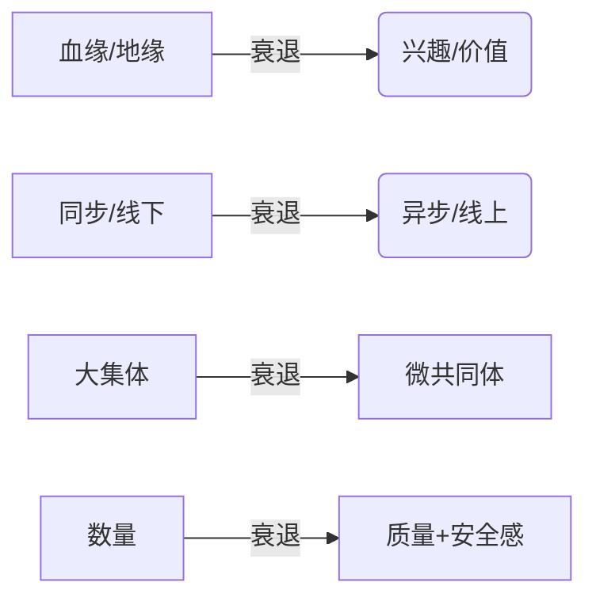

# 🤔 原子化社会还需要 social 吗？
> 当“附近”消失、单位瓦解、宗族稀释，  
> 我们是在迎来“社交的终结”，  
> 还是一场“社交 2.0”的强制升级？

---

## 📊 原子化到底发生了什么？
| 维度 | 过去（高聚合） | 现在（原子化） |
|---|---|---|
| 地理 | 单位大院、乡村熟人 | 电梯公寓、独居青年 |
| 身份 | 终身职业、户籍 | 斜杠、数字游民 |
| 时间 | 朝九晚五同步 | 24h 碎片异步 |
| 技术 | 固定电话、口耳相传 | 算法推荐、无限滑屏 |
| 社会资本 | 高存量、低流动 | 低存量、高流动 |

结果：  
- 传统“强关系”供给不足 → 情感、资源、信息三缺口同时出现。  
- 人成为“自由电子”，拥有空前选择权，也拥有空前坠落距离。

---

## 🔄 社交需求曲线
社交需求曲线：没有消失，只是变形

---

## 🎯原子化时代更需要“新型 social”？
🎯 从“地缘+血缘”到“兴趣+价值”
宗族、单位、居委会衰落后，人靠共同爱好、身份认同、目标协作重新结社——线上社群、DAO、共创小组、运动/读书会都是例子。

🎯 从“大集体”到“微共同体”
不再追求 50 年不变的“铁关系”，而是“项目制”“短时深聊”“随时解散”的弹性结伴；这样既匹配流动的生活，也降低心理负担。

🎯 从“数量”到“质量”
原子化社会不缺“好友数”，缺“可被理解的瞬间”。因此 future social 的核心是“深度对话机制”＋“心理安全感”，而非简单把人拉到一个群里。

---

## 📚 历史速览：30 秒看懂全球“原子化”
| 地区 | 引爆点 | 真实托底（已存在） | 社交新形态（已普及） |
|---|---|---|---|
| 日本 1990s | 泡沫破裂+终身制瓦解 | 便利店公共厨房、NPO 陪聊、介护机器人租赁 | 短租“空き家”共居、寺院代扫墓按需下单 |
| 韩国 2000s | 高房价+教育内卷 | 网咖 24h 语音房、教会逃离潮 | 手游“房”文化、线下应援站快闪 |
| 欧盟 2010s | 福利紧缩+独居 30% | Meetup 付费订阅、共居公寓 Co-living | Parkrun 免费 5 km、城市“时间银行”App |
| 美国 2010s | 零工经济+屏幕孤独 | 付费木屋 Retreat、健身房团课会员 | Discord 实时语音+DAO 任务分工 |

结论：国家没发“孤独险”，但**市场+志愿结社**已把社交切成**可订阅、可计时、可评分**的服务。

---

## 🔮 趋势
2024-2029 正在发生的 5 条趋势

1. **“10 分钟社交”微单元**  
   线下健身房把团课压缩到 30 分钟，课前 3 分钟破冰、课后 7 分钟加微信群→本月用完即散。  
2. **兴趣 DAO 落地中国**  
   小程序+微信群已跑通“剧本杀 DAO”：编剧、DM、玩家全链上分账，单局结束自动结算。  
3. **“附近”再商业化**  
   便利店+社区书店联合推出“晚餐搭子”套餐：扫码拼桌，消费满 30 元送破冰卡牌。  
4. **语音房下沉到 40+ 岁**  
   三四线城市出现“象棋语音房”，50 岁用户日均在线 2 h；打赏主力是子女代充 5-10 元。  
5. **“社交订阅制”写进租房合同**  
   集中式长租公寓每月赠送 2 次“邻居局”，不参加不影响租金，参加可抵 50 元水电费——提高续租率 8 %（深圳泊寓 2023 试点数据）。

---

## 🚫 原子化 ≠ 零社交
- 只是“弱联结”成为默认，不是“零联结”。  
- 信息、资源、情感支持仍要通过某种“social”完成。  
- 移动社交爆发本身证明：越原子化，越渴望“可控制的社交”——保持边界感，又能随时获得陪伴与承认。  
- 实证研究：长期缺乏面对面、深层次的互动，抑郁、焦虑、政治冷漠都会上升；完全断联的“零社交”几乎等同于健康自杀。

---

## 🔄 新型 social 长啥样
| 旧范式 | 新范式 | 案例 |
|---|---|---|
| 地缘+血缘 | 兴趣+价值 | 线上 DAO、共创小组、飞盘局 |
| 大集体 | 微共同体 | 项目制考研群、短时深聊、随时解散 |
| 好友数量 | 可被理解的瞬间 | 小型语音房、安全屋、10 分钟社交 |

核心：深度对话机制 + 心理安全感，而非简单把人拉到一个群里。

---

## ⚠️ 彻底断社交会怎样
| 层面 | 后果 | 正在发生的样本 |
|---|---|---|
| 个人 | 社会资本归零，抗风险断崖 | 日韩“孤独死”报告年均 3 万起 |
| 组织 | 创新依赖弱联结信息；断联=低创意 | 远程团队文化空心，离职率高 25 % |
| 社会 | 公共议题无人协商，极端势力乘虚 | 投票率下降、网络极化 |

---

## 🎯 结论：社交的升级关卡，不是终点
原子化社会“更需要”social，只是这种 social 必须更轻、更准、更真诚，也更尊重每个人的“退出权”。  
拒绝社交，最终只会让原子化的孤独从“自由”变成“牢笼”。

---

## ✅ 个人行动清单
1. 每年留 1 个“付费兴趣订阅”——付费=筛选=可退出。  
2. 微信置顶 3 个“项目群”：考证照/健身/看展，项目结束就退。  
3. 把“邻居”当工具人：加楼群，只聊快递、拼单、停电，不求深交但留后门。  
4. 30 岁后每 18 个月更新一次“紧急联系人”列表，保持 2 条异地、1 条同城。  

---

> 🌱 原子化不会逆转，  
> 社交也不会消失，  
> 它正变成**按次结算、随时静音**的  
> **“关系云服务”**。  
>  
> 早点学会“订阅”，  
> 就不用被迫“断网”。